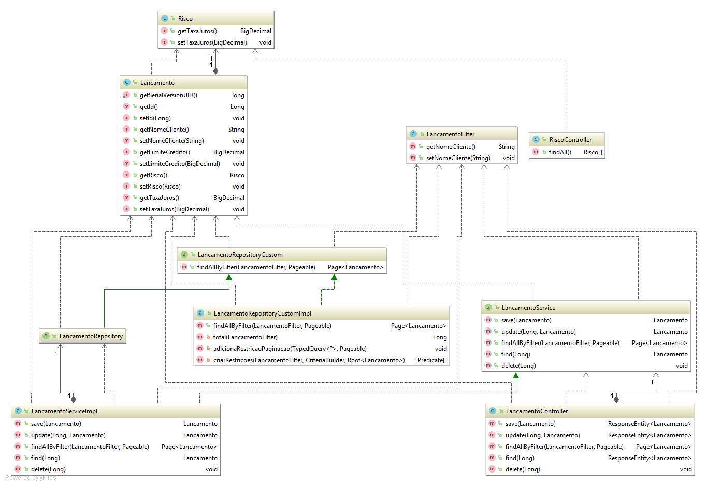

# Lancamentos prova srm - Simple Springboot + mysql application

### Mysql configuraçao.
* Database: prova_srm_db
* url: jdbc:mysql://localhost:3306/prova_srm_db
* port: 3306
* username: root
* password: root

* Se quiser alterar as configuracoes do banco, alterar no arquito application.properties

### Para rodar
mvn package spring-boot:run

### Documentacao dos endpoints no Swager

* [http://localhost:8080/swagger-ui.html](http://localhost:8080/swagger-ui.html)

### Tests

* Run with junit to test some demo testcases.

### Gaps

* Por falta de tempo, não fiz 100% de cobertura dos casos de teste
* CorsFilter esta configurado para aceitar todo o tipo de origem, em produção deve se especificar uma origem para se evitar ataques

### Class Diagram

### Used tools

[Swagger](https://swagger.io)

[Spring Boot](http://projects.spring.io/spring-boot/)

[Spring Data](http://projects.spring.io/spring-data/)

[MySql](https://www.mysql.com/)

[Flyway](https://flywaydb.org/)

[Mockito](http://site.mockito.org)

[Junit](https://junit.org)

[Maven](https://maven.apache.org)